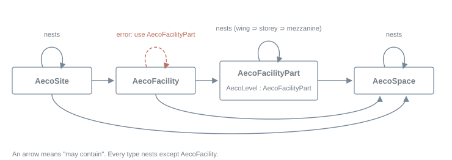
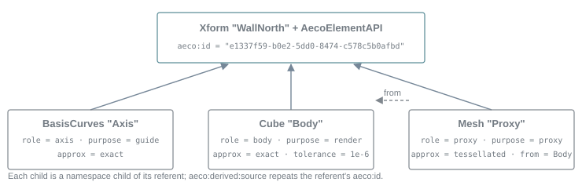

# Overview

The styled version is the [HTML page](overview.html).

**Contents**

- [usdAeco Schemas and Concepts](#usdaeco-schemas-and-concepts)
- [Identity](#identity)
- [Phase and Time](#phase-and-time)
- [Composing Without Plugins](#composing-without-plugins)
- [Standardized and Ad-hoc Properties](#standardized-and-ad-hoc-properties)
- [Validation](#validation)
- [The Core and the Other Domains](#the-core-and-the-other-domains)
- [Schema Classes](#schema-classes)
- [Examples](#examples)

The usdAeco schema domain contains schemas for describing the built environment: the sites,
facilities, levels and spaces of a built thing, the elements inside them, and the identity,
classification, grouping and connectivity those elements share. usdAeco is designed to carry the
semantics every dataset about a built thing needs, in a small, codeless form that composes on any
OpenUSD runtime.

usdAeco is the *core* of a suite of AECO schema domains. This guide covers the core only. Everything
a downstream domain adds — path drivers, layered sections, walls, pipes, cameras, programmes, host
synchronization — is deliberately kept out of the core and is described in its own guide. See
[The Core and the Other Domains](#the-core-and-the-other-domains) for how the two relate and what
the core does not contain.


The small building example: 16 elements on two levels, catalog inheritance and a connected
cold-water run. Every gprim is ordinary UsdGeom marked as derived; the blue curve is a wall axis
rendered as guide geometry.

## usdAeco Schemas and Concepts

usdAeco includes several schemas that provide the following features:

- Mark a stage as an AECO project
- Represent the spatial structure (e.g. AecoLevel, AecoSpace)
- Endow element capabilities
- Classify prims against external dictionaries
- Represent catalog types and their occurrences
- Represent groups: systems and zones
- Represent connectivity with ports
- Mark derived geometry

Each of these is described in the following sections.

### Marking a Project

The [AecoProjectAPI](#aecoprojectapi) schema is applied to the root model prim of a stage and marks
it as an AECO project, carrying the project name and a stable project identifier. Units and up axis
remain UsdGeom stage metrics (`metersPerUnit`, `upAxis`). The schema deliberately carries nothing
else: conventions that only matter to a downstream domain, such as a calendar epoch for 4D views,
are declared by that domain's own root schema.

```usda
def Xform "SmallProject" (
    prepend apiSchemas = ["AecoProjectAPI"]
    kind = "assembly"
)
{
    string aeco:project:id = "22de894f-1a16-5d9b-82f4-988837ce6db1"
    string aeco:project:name = "Schema Demo House"
}
```

### Representing the Spatial Structure

usdAeco provides five typed schemas that represent the spatial structure of a built thing:
[AecoSite](#aecosite), [AecoFacility](#aecofacility), [AecoFacilityPart](#aecofacilitypart),
[AecoLevel](#aecolevel) and [AecoSpace](#aecospace). All five derive from
[AecoSpatialBase](#aecospatialbase-), which in turn derives from Xformable, so that every spatial
container can be transformed like any Xformable prim and carries a stable identity (`aeco:id`) and a
lifecycle phase (`aeco:phase`).

Containment is the USD namespace: a prim's container is its nearest spatial ancestor. Organizational
Scopes and Xforms may sit in between and are invisible to the containment rules. Which spatial prims
may contain which is a four-rule grammar, with recursion at every type:

```text
site     ⊃ { site, facility, space }
facility ⊃ { part, space }
part     ⊃ { part, space }          (a level is a part)
space    ⊃ { space }
```



The containment grammar. It is enforced by a validator at error tier; unanchored parts and spaces
only warn.

Note that a facility may not contain another facility: a podium with two towers is one AecoFacility
whose major divisions are AecoFacilityParts, and separately operated assets are sibling facilities
related by systems and references. AecoLevel derives from AecoFacilityPart, so a level may contain a
level (a mezzanine), and it carries the one property every vertical facility shares, its datum
elevation. The following example is the top of a campus with a podium development, taken from the
hard-cases example stage.

```usda
def AecoSite "Campus"
{
    def AecoSite "ParcelNorth"
    {
        def AecoFacility "Development" (
            prepend apiSchemas = ["AecoClassificationAPI:ifc"]
        )
        {
            string aeco:class:ifc:code = "IfcBuilding"

            def AecoFacilityPart "Podium"
            {
                def AecoLevel "L0"
                {
                    double aeco:elevation = 0

                    def AecoSpace "Lobby" { }

                    def AecoLevel "Mezzanine"
                    {
                        double aeco:elevation = 2.1
                    }
                }
            }
            def AecoFacilityPart "TowerA" { }
            def AecoSpace "Atrium" { }
        }
        def AecoSpace "Plaza" { }
    }
}
```

The kind of a spatial prim — building or road, wing or road section, room or plaza — is never a
subtype. It is classification, exactly as for elements (see
[Classifying Prims](#classifying-prims)). There is no AecoBuilding: a building is an AecoFacility
classified as one, and a road is an AecoFacility classified as `IfcRoad` whose sections are
AecoFacilityParts. Type is structure; kind is data.

| Schema | Represents | Fallback type |
| --- | --- | --- |
| [AecoSite](#aecosite) | An area of land or water under development; sites nest (campus ⊃ parcels) | Xform |
| [AecoFacility](#aecofacility) | One built asset operated as a whole: a building, bridge, road, tunnel, plant | Xform |
| [AecoFacilityPart](#aecofacilitypart) | A structural subdivision of a facility: wing, tower, podium, road section; concrete and recursive | Xform |
| [AecoLevel](#aecolevel) | The one universal part: a horizontal stratum at a datum elevation | Xform |
| [AecoSpace](#aecospace) | A bounded usable region, interior or exterior: room, hall, yard, atrium, plaza; spaces nest | Xform |

### Endowing Element Capabilities

The [AecoElementAPI](#aecoelementapi) schema imparts "element capabilities" to the prim it is
applied to, so the prim can be treated as being a built element. The schema can be applied to any
Imageable prim — an Xform, a Mesh, a referenced asset — and gives it a stable identity (`aeco:id`),
a lifecycle phase (`aeco:phase`) and optional secondary spatial anchors
(`aeco:referencedContainers`). usdAeco provides no typed element hierarchy: what an element *is*
comes from classification.

```usda
def Xform "WallPartition" (
    prepend apiSchemas = ["AecoElementAPI", "AecoClassificationAPI:ifc"]
)
{
    string aeco:id = "59c47682-097a-5121-b9ae-ec35085e206f"
    uniform token aeco:phase = "proposed"
    string aeco:class:ifc:code = "IfcWall.PARTITIONING"
    string aeco:class:ifc:name = "Wall (partitioning)"
}
```

An element is where the containment grammar stops. Below an element, namespace is assembly
structure, not spatial containment: a door nested inside a curtain-wall element is legal and
ordinary, and containment queries see *through* element subtrees to the nearest spatial ancestor. An
element that spans containers beyond its own — a riser serving upper levels, a skybridge reaching
the other tower, a culvert serving the adjacent road section — lists them in
`aeco:referencedContainers`, authored on the element by the discipline that owns it.

```usda
def Xform "SkyBridge" (
    prepend apiSchemas = ["AecoElementAPI", "AecoClassificationAPI:ifc"]
)
{
    string aeco:id = "07ef25f4-da8b-50bd-b1a5-49677c74d3df"
    string aeco:class:ifc:code = "IfcElementAssembly.USERDEFINED"
    prepend rel aeco:referencedContainers = </Metro/Campus/ParcelNorth/Development/Parts/TowerB/B_L1>
}
```

A spatial prim or a port that itself wears AecoElementAPI is a validator error: containers, ports
and elements are referents of different kinds.

### Classifying Prims

The [AecoClassificationAPI](#aecoclassificationapi) schema is a multiple-apply schema that binds a
prim to one entry of one external classification system. Each instance is named for its system and
contributes a `code`, a `name` and a resolvable `uri` under the `aeco:class:<system>:` namespace.
Several instances per prim are normal and expected.

```usda
class "ExternalCavityWall" (
    prepend apiSchemas = ["AecoTypeAPI", "AecoClassificationAPI:uniclass", "AecoClassificationAPI:ifc"]
)
{
    string aeco:class:ifc:code = "IfcWall.SOLIDWALL"
    string aeco:class:ifc:name = "Wall (solid)"
    string aeco:class:ifc:uri = "https://identifier.buildingsmart.org/uri/buildingsmart/ifc/4.3/class/IfcWall"
    string aeco:class:uniclass:code = "Ss_25_10_20"
    string aeco:class:uniclass:name = "Wall systems"
    string aeco:class:uniclass:uri = "https://uniclass.thenbs.com/taxon/ss_25_10_20"
}
```

Classification is the *only* kind mechanism in the core. It applies to elements, spatial prims,
groups and catalog types alike: the kind of a facility (`IfcRoad`), of a system
(`IfcDistributionSystem.CHILLEDWATER`) and of a wall (`IfcWall.PARTITIONING`, `Ss_25_10_20`) all
ride the same mechanism. usdAeco carries no census token or taxonomy of its own, so "all walls" is
one query in whichever dictionary the data uses, and nothing in the core needs re-mapping when a
dictionary revises. The IFC entity is the recommended default system because every authoring tool
can emit it; the code form is the entity name, then the PredefinedType after a dot when one is set.

Instance names are governed tokens from the `classification_systems` registry (`ifc`, `uniclass`,
`omniclass`, `uniformat`, `masterformat`, `etim`, `bsdd`), so two tools name the same dictionary the
same way. Validators warn on an unknown system, on an empty code, and on elements with no
classification at all or classified only as a proxy — the measurable version of proxy abuse.

### Representing Types and Occurrences

The [AecoTypeAPI](#aecotypeapi) schema marks a class prim as a catalog type — a product or type
definition — and carries product identity: manufacturer, model and catalog URI. Occurrences compose
the type through an `inherits` arc, so type/occurrence *is* USD composition: edits to the type
broadcast to every occurrence, and an occurrence's own opinions override the type's by composition
strength. No relationship needs chasing; `attr.Get()` on the occurrence is already right.

```usda
class "_TypeCatalog"
{
    class "ExternalCavityWall" (
        prepend apiSchemas = ["AecoTypeAPI", "AecoClassificationAPI:ifc"]
    )
    {
        string aeco:class:ifc:code = "IfcWall.SOLIDWALL"
        string aeco:type:manufacturer = "Example Masonry Ltd"
        string aeco:type:model = "Cavity wall 300 (102.5 / 100 / 100)"
    }
}

def Xform "WallNorth" (
    prepend apiSchemas = ["AecoElementAPI"]
    prepend inherits = </_TypeCatalog/ExternalCavityWall>
)
{
    # Resolves aeco:class:ifc:code and aeco:type:model from the type.
    string aeco:id = "e1337f59-b0e2-5dd0-8474-c578c5b0afbd"
}
```

Applied schemas compose through inherits too, so the occurrence resolves the type's manufacturer as
its own (correct: the manufacturer of the type is the manufacturer of every occurrence). Enumerate
the *catalog* over class prims (`Usd.PrimIsAbstract`), not over `HasAPI` alone. Identity stays on
the occurrence: a type prim never carries an `aeco:id`.

### Representing Groups: Systems and Zones

usdAeco provides two typed schemas that overlay groups on the spatial structure.
[AecoSystem](#aecosystem) represents a functional service network — a piping run, an air loop, a
circuit, a structural frame — the logical view of a service, distinct from its spatially placed
members. [AecoZone](#aecozone) represents a purpose grouping — a fire compartment, an HVAC zone, a
security zone, a department. Both derive from [AecoGroupBase](#aecogroupbase-), which carries an
identity and a built-in `members` collection (`CollectionAPI:members`, expansion rule `explicitOnly`
by fallback). A group is its members plus an identity: membership never changes where a thing is,
and anything may belong to any number of groups.

```usda
def AecoSystem "DomesticColdWater" (
    prepend apiSchemas = ["AecoClassificationAPI:ifc"]
    displayName = "Domestic Cold Water"
)
{
    string aeco:id = "e9f6b301-f133-5f40-82b8-95a349687722"
    string aeco:class:ifc:code = "IfcDistributionSystem.DOMESTICCOLDWATER"
    prepend rel aeco:serves = </SmallProject/Site/Building>
    prepend rel collection:members:includes = [
        </SmallProject/Site/Building/Level1/CWEntry>,
        </SmallProject/Site/Building/Level1/CWRiser>,
        </SmallProject/Site/Building/Level2/Bathroom/CWBranch>,
        </SmallProject/Site/Building/Level2/Bathroom/Basin>,
    ]
}

def AecoZone "FireCompartmentFC1" (
    prepend apiSchemas = ["AecoClassificationAPI:ifc"]
    displayName = "Fire compartment FC1"
)
{
    string aeco:id = "1ec53345-e096-599c-8bf1-194eb5e39d97"
    string aeco:class:ifc:code = "IfcSpatialZone.FIRESAFETY"
    prepend rel collection:members:includes = [
        </Metro/Campus/ParcelNorth/Development/Parts/Podium/L0/Lobby>,
        </Metro/Campus/ParcelNorth/Development/Parts/TowerA/A_L2/Bathroom>,
    ]
}
```

AecoSystem adds `aeco:serves`, the spatial prims or zones a service reaches. This is coarser than
member connectivity and valid before any pipe is drawn: a cold water system serves a building at
concept stage. The kind of a group is classification, and its human label is the prim's
`displayName` metadata. A group carries no status, owner or title-as-data; those are statements
*about* a group and belong to a downstream domain. Zones may overlap freely and never nest
spatially; when a zone needs a volumetric extent, that extent is an AecoSpace at its natural place
in the tree, grouped by the zone.

A plain selection set needs no AECO type at all: a `CollectionAPI` instance on any prim is USD's own
grouping. Downstream domains refine systems and zones with applied schemas that declare
`apiSchemaCanOnlyApplyTo = ["AecoSystem"]` or `["AecoZone"]`; nothing subclasses them.

### Representing Connectivity with Ports

The [AecoPort](#aecoport) schema represents a typed connection point on an element. A port is
authored as a child prim, so it has a transform (the physical connection location) and can be
targeted by relationships. Ports carry a medium (`pipe`, `duct`, `cable`, `cableCarrier`,
`wireless`, `other`), a flow direction (`source`, `sink`, `bidirectional`) and the symmetric
`aeco:connectedPorts` relationship, authored on both ends.

```usda
def Xform "CWEntry" (
    prepend apiSchemas = ["AecoElementAPI", "AecoClassificationAPI:ifc"]
)
{
    string aeco:id = "ab096698-1b91-5c84-810c-5150bea6d9ce"
    string aeco:class:ifc:code = "IfcPipeSegment.RIGIDSEGMENT"

    def AecoPort "Out"
    {
        string aeco:id = "d3356492-f76a-5470-9e37-b81f9d7bf4cc"
        uniform token aeco:medium = "pipe"
        uniform token aeco:flowDirection = "source"
        prepend rel aeco:connectedPorts = </SmallProject/Site/Building/Level1/CWRiser/In>
        double3 xformOp:translate = (-3.5, 1.4, 0.5)
        uniform token[] xformOpOrder = ["xformOp:translate"]
    }
}
```

Ports have `purpose = guide` by fallback, so vanilla viewers hide them unless guides are shown; this
is safe because ports carry no renderable children. `undefined` is a wildcard for both medium and
flow direction: the validators refuse only *stated* incompatibilities — a pipe port connected to a
cable port, a source connected to a source — and flag asymmetric or dangling links. The core defines
no connection entities and no shading-style attribute connections: dataflow is not physical
topology.

### Marking Derived Geometry

usdAeco adds no geometry schema. Geometry is ordinary UsdGeom — a Cube, a Cylinder, a Mesh, a
BasisCurves — authored as a child of the referent it stands for, and the
[AecoDerivedGeometryAPI](#aecoderivedgeometryapi) schema marks it as *derived*: which referent it
pictures (`aeco:derived:source` repeats the referent's `aeco:id`), what it is a picture of
(`aeco:derived:role`), how faithful it is (`aeco:derived:approx`), which tool produced it
(`aeco:derived:stamp`), which other representation it was derived from (`aeco:derived:from`) and the
tolerance the derivation honoured (`aeco:derived:tolerance`, in metres).



Plain UsdGeom gprims plus one applied schema is the whole representation pattern. The mark adds no
geometry type.

```usda
def Xform "WallNorth" (
    prepend apiSchemas = ["AecoElementAPI"]
)
{
    string aeco:id = "e1337f59-b0e2-5dd0-8474-c578c5b0afbd"

    def BasisCurves "Axis" (
        prepend apiSchemas = ["AecoDerivedGeometryAPI"]
    )
    {
        string aeco:derived:source = "e1337f59-b0e2-5dd0-8474-c578c5b0afbd"
        uniform token aeco:derived:role = "axis"
        uniform token aeco:derived:approx = "exact"
        string aeco:derived:stamp = "small building 0.9.2"
        double aeco:derived:tolerance = 0.000001
        uniform token purpose = "guide"
        uniform token type = "linear"
        int[] curveVertexCounts = [2]
        point3f[] points = [(-3.2, 2.1, 0.2), (3.2, 2.1, 0.2)]
    }

    def Cube "Geom" (
        prepend apiSchemas = ["AecoDerivedGeometryAPI"]
    )
    {
        string aeco:derived:source = "e1337f59-b0e2-5dd0-8474-c578c5b0afbd"
        uniform token aeco:derived:role = "body"
        uniform token aeco:derived:approx = "exact"
        string aeco:derived:stamp = "small building 0.9.2"
        double aeco:derived:tolerance = 0.000001
        double size = 1
        double3 xformOp:scale = (6.4, 0.2, 2.7)
        double3 xformOp:translate = (0, 2.1, 1.55)
        uniform token[] xformOpOrder = ["xformOp:translate", "xformOp:scale"]
    }
}
```

| Role | What the gprim is a picture of | Required purpose |
| --- | --- | --- |
| `body` | The element's body (the fallback) | render |
| `proxy` | A lightweight stand-in for the body | proxy |
| `axis` | The element's axis or centreline | guide |
| `footprint`, `symbol` | A plan footprint; a schematic symbol | — |
| `extent` | A spatial container's volume — never an obstacle | guide |
| `sector`, `coverage` | An analytic view sector; analytic clipped coverage | guide |
| `wireframe` | Edges extracted from an exact body | guide |

Two rules make exactness honest. A Mesh is never `approx = exact`, because a tessellation cannot be;
exact bodies are analytic UsdGeom primitives (Cube, Cylinder, Sphere, Cone, Capsule) or a BrepArray
carried by a kit outside the core, and a Mesh twin links its exact source through
`aeco:derived:from`. And an exact representation declares a positive tolerance; a missing one warns.
The other approximation tokens are `driverEval` (a stage-side evaluation of the element's drivers,
before host joins and clips), `tessellated`, `arcSegmented`, `defaultDims` and `bbox`.

Geometry flows *out* of authoring hosts and stage-side derivations into their own layers. The core
never presents a mesh as editing input, and the drivers that produce geometry — axes, sections,
joins, openings — live in downstream domains, not here.

## Identity

Every referent in usdAeco carries one identity attribute, `aeco:id`. Spatial prims, elements, groups
and ports share a single uniqueness space, enforced per stage by a validator; a lowercase hyphenated
UUID is recommended. `aeco:id` is the interchange join key: census, diffing, issue anchoring and FM
inventories join on it across every route. It is the counterpart of IFC's `GlobalId`, which encodes
the same 128-bit UUID in 22 characters:

```text
aeco_id   = str(uuid.UUID(hex=ifcopenshell.guid.expand(global_id)))
global_id = ifcopenshell.guid.compress(uuid.UUID(aeco_id).hex)
```

Because containment is namespace, restructuring a tree moves paths, and path-anchored relationships
in federated layers can dangle. Identity on every container, group and element makes the repair
mechanical: the companion `repath` tool re-anchors dangling targets by `aeco:id`, with
longest-prefix remapping so the ports and nested prims under a moved element follow it. Repairs
compose as opinions in a stronger layer without touching the stale one. There is no alternative
identity attribute and no equivalence property; several exports of the same referent compose
opinions on one `aeco:id`.

## Phase and Time

`aeco:phase` is the asset clock: which world a referent belongs to with respect to this project —
`proposed`, `existing`, `demolished` or `temporary`. It sits on elements and spatial prims alike, so
a renovation models the existing fabric and the proposed remodel in one structure:

```usda
def AecoFacilityPart "WingB"
{
    uniform token aeco:phase = "existing"

    def AecoLevel "L1"
    {
        uniform token aeco:phase = "existing"

        def AecoSpace "Office"
        {
            uniform token aeco:phase = "existing"

            def Xform "Partition1" (prepend apiSchemas = ["AecoElementAPI"])
            {
                uniform token aeco:phase = "demolished"
            }
            def Xform "Partition2" (prepend apiSchemas = ["AecoElementAPI"])
            {
                uniform token aeco:phase = "proposed"
            }
        }
    }
}
```

Phase is not status: it names which world a referent belongs to, not where a workflow stands. The
core carries *no date at all*. Information time — what was said when — is layers and layer metadata,
which USD already provides; work time — when work happens — belongs to record prims in a downstream
domain, and neither is ever encoded as `UsdTimeCode` samples. Design options are a `VariantSet` on
the spatial referent: a representation choice on one state, never a clock.

## Composing Without Plugins

A usdAeco stage remains an ordinary USD stage. Every stage authors `fallbackPrimTypes` for the core
types it uses, so a runtime with no AECO plugins installed composes an AecoLevel as an Xform and an
AecoSystem as a Scope, with identical transforms and legible data:

```usda
#usda 1.0
(
    defaultPrim = "SmallProject"
    metersPerUnit = 1
    upAxis = "Z"
    fallbackPrimTypes = {
        token[] AecoSite = ["Xform"]
        token[] AecoFacility = ["Xform"]
        token[] AecoFacilityPart = ["Xform"]
        token[] AecoLevel = ["Xform"]
        token[] AecoSpace = ["Xform"]
        token[] AecoPort = ["Xform"]
        token[] AecoSystem = ["Scope"]
        token[] AecoZone = ["Scope"]
    }
)
```

Applied schemas compose without the plugin as well; their properties simply appear as authored
attributes. Renderers install nothing. The usdAeco plugin itself is codeless — `plugInfo.json` plus
`generatedSchema.usda` — and registers one property metadatum, `aecoDerived`, which downstream
schemas use to declare a property as host-reported rather than editor-authored.

## Standardized and Ad-hoc Properties

Properties have two tiers and no third place. Standardized properties are schema attributes — of the
core in the `aeco:` namespace, or of a downstream domain in its own `aeco:<library>:` namespace —
with documentation, SI-fixed units, fallbacks and allowed tokens. Ad-hoc data lives only under
`aeco:props:<Set>:<name>`, where the set name comes from a sanctioned group in the `prop_sets`
registry (`Pset_*`, `Qto_*`, `Ifc*`, `source`):

```usda
double aeco:props:Pset_PipeSegmentTypeCommon:NominalDiameter = 25
```

The quarantine is deliberately open: any tool may stash namespaced data there without a schema
change, and conformance reports which sets a stage uses. Governed and project data stay mechanically
distinguishable, and a generic viewer can display unknown sets safely.

## Validation

usdAeco ships eight UsdValidation validators under the `UsdAecoValidators` keyword. Universal rules
error; sector-contextual rules warn. A conformance *profile* is a JSON document that re-grades named
rules for a sector or an exchange (`"unclassifiedElement": "error"`); profiles never add rules, only
harden them.

| Validator | Rules (error unless marked warn) |
| --- | --- |
| IdentityChecker | `missingId` (elements; warn elsewhere), `malformedId` (warn), `duplicateId` |
| SpatialGrammarChecker | `facilityInFacility`, `badSpatialNesting`, `spatialIsElement`, `portIsElement`; `unanchoredSpatial`, `spatialInsideElement`, `levelWithoutElevation`, `elevationDrift` (warn) |
| ClassificationChecker | `unclassifiedElement`, `emptyClassificationCode`, `unregisteredClassificationSystem`, `proxyClassified` (all warn) |
| PortConnectivityChecker | `danglingPortLink`, `asymmetricPortLink`, `incompatibleFlow`, `mediumMismatch` |
| GroupChecker | `zoneAuthorsServes`, `servesTargetsNonSpatial`, `danglingMember` (warn) |
| DerivedGeometryChecker | `derivedGeometryOrphan`, `derivedGeometryRole`, `derivedGeometryPurpose` (warn) |
| DerivedExactOnMeshChecker | `DerivedExactOnMesh`: a Mesh cannot declare `approx = exact` |
| ExactWithoutToleranceChecker | `ExactWithoutTolerance`: an exact representation without a positive, finite tolerance (warn) |

## The Core and the Other Domains

usdAeco is closed and small: five spatial types, two group types, one port type, two abstract bases
and five applied schemas. A consumer that knows these can traverse an entire built thing and will
never meet another core structure. Everything else in the suite is a separate schema domain that
*applies to* core prims and never subclasses them. The core has no dependencies; every other domain
depends on the core; and the dependencies form a tiered graph whose edges point strictly toward the
more generic tier.

| Tier | Domains and tools | Notes |
| --- | --- | --- |
| Hosts and tools | usdaeco-ifc, usdaeco-revit, usdaeco-bonsai, usdaeco-toolchain, usdaeco-cctv-exec | integrations and kits, not schema domains |
| Record | usdAecoSync | intent, result and diagnostics layers for host synchronization |
| Kind | usdAecoWall, usdAecoPipe, usdAecoCctv, usdAecoClash, usdAecoPlan, usdAecoRepeat, usdAecoCompliance, usdaeco-solid |  |
| Section | usdAecoAxis, usdAecoBuildUp | shared contracts a kind library may sublayer |
| Core | usdAeco | this guide — no dependencies, no geometry, no dates, no taxonomy of its own |

Each tier depends only on the tiers below it. A kind library never depends on another kind library;
cross-kind rules live in validation, keeping the graph acyclic. dashed chips are integrations and
tooling, which ship no schemas of their own.

The clearest way to read the boundary is by what the core refuses to hold. Each item below is real
and needed; it is simply owned by another domain, so that the core stays reviewable in an afternoon
and never accumulates a vocabulary it would have to maintain.

| Not in the core | Where it lives |
| --- | --- |
| Geometry drivers: axes, layered sections, joins, openings, nominal sizes | usdAecoAxis and usdAecoBuildUp (section tier); usdAecoWall, usdAecoPipe (kind tier) |
| Exact bodies: BrepArray, kernel evaluation, measured clearances | usdSolid and usdSolidOcct (shared kits outside the suite); usdaeco-solid |
| Cameras and coverage; clash evidence; programmes and 4D playback; repeated-floor drift; requirement checks | usdAecoCctv, usdAecoClash, usdAecoPlan, usdAecoRepeat, usdAecoCompliance |
| Host synchronization: intent layers, solved results, diagnostics, refusal reasons | usdAecoSync, with usdaeco-ifc, usdaeco-revit and usdaeco-bonsai as hosts |
| Register rows: status, owner, title-as-data, documents, cost, dates | The record tier, as applied statements *about* core referents |
| A kind vocabulary: element categories, facility subtypes, system types | Nowhere in the suite — kind is always an external classification |
| Datums, grids, alignments, geodetic anchoring | Open; deferred to OpenUSD's own geospatial and future work |
| Materials, lighting, physics, rendering | The existing OpenUSD domains, which AECO schemas only reference |

A downstream domain is conformant when it follows the extension contract, which a schema review can
check in the library itself:

- **Extend vocabulary, never structure.** Add applied schemas freely; add typed prims only for
  genuinely new referents; never subclass AecoSpatialBase or AecoGroupBase; never add a second
  containment, grouping, connectivity or identity mechanism.
- **Decorate, never capture.** Attach semantics in your own `aeco:<library>:` namespace; never retype
  or reparent another discipline's prims.
- **Kind via classification only.** No typed prim, parallel enum or census token per product kind.
- **Groups through the core, connectivity through ports.** Refinement is an applied schema with
  `apiSchemaCanOnlyApplyTo` declared.
- **One identity.** `aeco:id` everywhere; per-occurrence, never on type prims.
- **Drivers in, derived out.** Editors author drivers; hosts and derivations write derived values into
  their own layers; a derived property is declared with the `aecoDerived` metadatum in the schema,
  never in stage data.
- **Semantics only.** Geometry, materials, physics, lighting and rendering belong to the existing USD
  domains.
- **Ship conformant.** Codeless build, declared core-version conformance, registered tokens,
  application restrictions authored, the shared validation suite green on a submitted example.

The following table lists the schema domains of the suite as of this writing, with the domains each
requires. Each will have a guide of its own; none of them is part of usdAeco.

| Domain | Tier | Adds | Requires |
| --- | --- | --- | --- |
| usdAeco | core | Identity, spatial structure, classification, groups, ports, catalog inheritance, phase, the derived-geometry mark | — |
| usdAecoAxis | section | Line and circular-arc path drivers for walls, pipes and beams; derived guide curves | usdAeco |
| usdAecoBuildUp | section | Layered sections shared by walls, floors, roofs and ceilings, owned by catalog classes | usdAeco |
| usdAecoWall | kind | Wall drivers: axis, section, joins and openings; bodies from the authoring kernel | usdAeco, Axis, BuildUp |
| usdAecoPipe | kind | Pipe drivers, catalogs and connected fittings with ports | usdAeco, Axis |
| usdAecoCctv | kind | Camera drivers and coverage derivations over the built thing | usdAeco |
| usdAecoClash | kind | Mesh and exact clash evidence with measured uncertainty | usdAeco |
| usdAecoPlan | kind | Programmes, workspace checks and derived 4D playback | usdAeco |
| usdAecoRepeat | kind | Repeated floors, explicit drift and measured quantities | usdAeco, BuildUp, Axis |
| usdAecoCompliance | kind | Requirements measured against the built model | usdAeco |
| usdaeco-solid | kind | Exact bodies with ordinary USD proxy twins | usdAeco, usdaeco-ifc, usdSolid, usdSolidOcct |
| usdAecoSync | record | Edit drivers in an intent layer; a host solves; results and diagnostics are published separately | usdAeco, Axis |

## Schema Classes

Every property of the core, with its USD type and fallback. The authoritative source is
`usdAeco/schema.usda`, whose doc strings carry the reasoning. Lengths are stage linear units unless
stated; ° marks an abstract type, never serialized in a stage.

#### AecoSpatialBase °

Abstract typed schema. Inherits `Xformable`. Root of the five spatial types; libraries must not
subclass it.

| Property | USD type | Fallback | Description |
| --- | --- | --- | --- |
| `aeco:id` | string | `""` | Stable, globally unique identity; shares one uniqueness space with elements, groups and ports. |
| `aeco:phase` | uniform token | `proposed` | Lifecycle phase with respect to this project: `proposed`, `existing`, `demolished`, `temporary`. |

#### AecoSite

Typed schema. Inherits `AecoSpatialBase`. Fallback type `Xform`. An area of land or water under
development; sites nest and may directly contain facilities, spaces and site-works elements. No
properties of its own.

#### AecoFacility

Typed schema. Inherits `AecoSpatialBase`. Fallback type `Xform`. One built asset operated as a
whole; its kind comes from classification. A facility may not contain another facility. No
properties of its own.

#### AecoFacilityPart

Typed schema. Inherits `AecoSpatialBase`. Fallback type `Xform`. A structural subdivision of a
facility: wing, tower, podium, road section, process unit. Concrete and recursive. No properties of
its own.

#### AecoLevel

Typed schema. Inherits `AecoFacilityPart`. Fallback type `Xform`. A horizontal stratum at a datum
elevation; levels are parts, so a level may contain a level.

| Property | USD type | Fallback | Description |
| --- | --- | --- | --- |
| `aeco:elevation` | double | `0` | Declarative datum elevation in the frame of the nearest ancestor facility, along the stage up axis. Placement remains xformOps; a validator warns when the two diverge. |

#### AecoSpace

Typed schema. Inherits `AecoSpatialBase`. Fallback type `Xform`. A bounded usable region, interior
or exterior; spaces nest and may sit under a site, a facility, a part or another space. No
properties of its own.

#### AecoGroupBase °

Abstract typed schema. Inherits `Typed`. Built-in applied schema `CollectionAPI:members`. Root of
the two group types; libraries must not subclass it or add a second membership mechanism.

| Property | USD type | Fallback | Description |
| --- | --- | --- | --- |
| `aeco:id` | string | `""` | Stable unique identity; groups are addressable artifacts. |
| `collection:members:expansionRule` | uniform token | `explicitOnly` | Membership is exactly the targeted prims; authors may opt into `expandPrims` or a membership expression per group. |

#### AecoSystem

Typed schema. Inherits `AecoGroupBase`. Fallback type `Scope`. A functional service network;
kind-specific data comes from applied schemas that declare
`apiSchemaCanOnlyApplyTo = ["AecoSystem"]`.

| Property | USD type | Fallback | Description |
| --- | --- | --- | --- |
| `aeco:serves` | rel | — | The spatial prims and/or zones this system functionally serves; valid without any modeled connectivity. |

#### AecoZone

Typed schema. Inherits `AecoGroupBase`. Fallback type `Scope`. A purpose-driven grouping of spaces,
regions and/or elements; zones may overlap freely and never nest spatially. No properties of its
own.

#### AecoPort

Typed schema. Inherits `Xformable`. Fallback type `Xform`. A typed connection point, authored as a
child prim of its element.

| Property | USD type | Fallback | Description |
| --- | --- | --- | --- |
| `purpose` | uniform token | `guide` | Fallback override of the Imageable purpose: ports hide in vanilla viewers unless guides are shown. |
| `aeco:id` | string | `""` | Stable unique identity for commissioning and fabrication records. |
| `aeco:medium` | uniform token | `undefined` | What passes or connects at this port: `pipe`, `duct`, `cable`, `cableCarrier`, `wireless`, `other`, `undefined`. |
| `aeco:flowDirection` | uniform token | `undefined` | Flow relative to the owning element: `source`, `sink`, `bidirectional`, `undefined`. |
| `aeco:connectedPorts` | rel | — | The port(s) this port is physically connected to; author on both ends. |

#### AecoProjectAPI

Single-apply API schema. Applies to `Xform`, on the root model prim.

| Property | USD type | Fallback | Description |
| --- | --- | --- | --- |
| `aeco:project:name` | string | `""` | Human-readable project name. |
| `aeco:project:id` | string | `""` | Stable project identifier for cross-tool correlation; the counterpart of `IfcProject.GlobalId`. |

#### AecoElementAPI

Single-apply API schema. Applies to `Imageable`; a validator refuses it on spatial prims and ports.

| Property | USD type | Fallback | Description |
| --- | --- | --- | --- |
| `aeco:id` | string | `""` | Stable, globally unique element identity; the interchange join key and the counterpart of `IfcRoot.GlobalId`. |
| `aeco:phase` | uniform token | `proposed` | Lifecycle phase: `proposed`, `existing`, `demolished`, `temporary`. |
| `aeco:referencedContainers` | rel | — | Secondary spatial anchors of any type, in any facility, that this element serves or spans beyond its primary container. |

#### AecoClassificationAPI

Multiple-apply API schema. Applies to `Typed`. Property namespace prefix `aeco:class`; instance
names are registered classification systems.

| Property | USD type | Fallback | Description |
| --- | --- | --- | --- |
| `aeco:class:<system>:code` | string | `""` | The code within this system, e.g. `Ss_25_10_20` or `IfcWall.PARTITIONING`. |
| `aeco:class:<system>:name` | string | `""` | Human-readable name of the classification entry. |
| `aeco:class:<system>:uri` | string | `""` | Resolvable dictionary URI pinning the exact system version. |

#### AecoTypeAPI

Single-apply API schema. Applies to `Typed`, on catalog class prims; occurrences compose it through
`inherits`.

| Property | USD type | Fallback | Description |
| --- | --- | --- | --- |
| `aeco:type:manufacturer` | string | `""` | Manufacturer or system owner of the cataloged product. |
| `aeco:type:model` | string | `""` | Model or product designation. |
| `aeco:type:catalogUri` | string | `""` | Resolvable product or catalog entry URI. |

#### AecoDerivedGeometryAPI

Single-apply API schema. Applies to `Gprim`; the gprim is a descendant of its element or spatial
referent.

| Property | USD type | Fallback | Description |
| --- | --- | --- | --- |
| `aeco:derived:source` | string | `""` | The `aeco:id` of the referent this gprim stands for. |
| `aeco:derived:role` | uniform token | `body` | `body`, `proxy`, `axis`, `footprint`, `symbol`, `extent`, `sector`, `coverage`, `wireframe`. |
| `aeco:derived:approx` | uniform token | `exact` | `exact`, `driverEval`, `tessellated`, `arcSegmented`, `defaultDims`, `bbox`. |
| `aeco:derived:stamp` | string | `""` | The deriving host or tool and its version. |
| `aeco:derived:from` | rel | — | The representation(s) this gprim was derived from, when not from the element itself; N:1 allowed. |
| `aeco:derived:tolerance` | double | `0` | The tolerance the derivation honoured, in metres; `0` means unknown. |

## Examples

The core repository ships six example stages that exercise the core directly, each with a flattened
result, editable layers and a stock USD preview:

- **early design** (the minimal alias): spaces, a system and a zone with no geometry at all — a
  complete, conformant dataset before any mesh exists.
- **small building**: 16 elements on two levels, a shared catalog type, a connected cold-water run and
  marked guide curves.
- **hard cases**: a campus of parcels, a podium with two towers, a mezzanine, an atrium, a plaza, a
  skybridge, a design-option variant set and a road in sections, in one stage.
- **renovation**: existing fabric, a demolished partition, a proposed one and a temporary compound in
  one structure.
- **road** and **service campus**: linear infrastructure with a drainage system; a plant with halls,
  yards and a standby-power system.

The smallest complete stage separates semantics from representation into two layers. The semantics
layer holds the referents; the derived layer, stronger in the sublayer stack, holds the geometry.
Muting the derived layer leaves identity, classification and connectivity intact:

```usda
#usda 1.0
(
    defaultPrim = "World"
    metersPerUnit = 1
    upAxis = "Z"
    fallbackPrimTypes = {
        token[] AecoFacility = ["Xform"]
        token[] AecoPort = ["Xform"]
    }
    subLayers = [@pipe.derived.usda@, @pipe.semantics.usda@]
)
```

See the [worked examples](../../../core/usdaeco-core/docs/07-worked-examples.md) for the complete
pipe run and wall corner, and the [design model](../../../core/usdaeco-core/docs/03-design-model.md)
for the reasoning behind every commitment described in this guide.

Written against usdAeco 0.9.5. Schema names, properties and fallbacks are taken from
`usdAeco/schema.usda`; example snippets are from the repository's example stages.

usdAeco is released under the MIT licence. This guide follows the structure of the OpenUSD schema
domain user guides.
