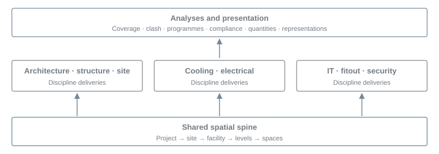
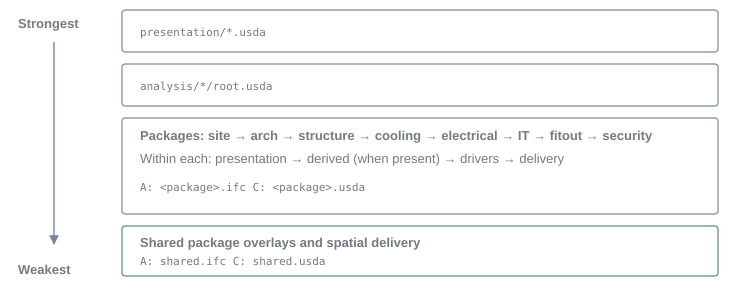
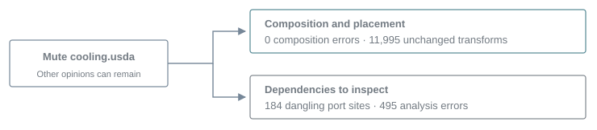

# Working with the integrated stage

The styled version is the [HTML page](index.html).

**Contents**

- [What the Stage Contains](#what-the-stage-contains)
- [Choosing a Form](#choosing-a-form)
- [Reading a Package Folder](#reading-a-package-folder)
- [Reading the Layer Stack](#reading-the-layer-stack)
- [Walking the Building](#walking-the-building)
- [Muting a Delivery](#muting-a-delivery)
- [Choosing a View](#choosing-a-view)
- [Reading the Connected Proof](#reading-the-connected-proof)
- [Where the Numbers Come From](#where-the-numbers-come-from)

The integrated stage brings the usdAECO suite's deliveries and studies into one building. Start with
the USD-only form, walk its spatial structure, then inspect which package supplies each element. The
[stage reference](../../stage/README.md) documents the published files and runtime setup; the
[suite walkthrough](../index.html#working-with-the-suite) covers the initial checkout.

## What the Stage Contains

Read the stage as a set of project deliveries: one shared spatial spine, packages by discipline, and
analyses above them. The `demo-datacentre-01` facility contains three levels, 41 spaces and 3,009
delivered elements. Eight discipline packages contribute site, architecture, structure, cooling,
electrical, IT, fitout and security elements. The shared package defines their spatial containers.
These counts are recorded in [manifest.json](../../stage/manifest.json) under `packages`,
`proofs.layout.elementsByPackage` and `proofs.vanilla.census`.



Deliveries overlay the shared containers. Studies add opinions above the deliveries; see the
[USD-only root's sublayers](../../stage/demo-datacentre-01.usd-only.usda).

The namespace describes location, layers describe delivery ownership, and collections describe
groups. Identity stays in `aeco:id`; kind comes from classification. Editors author drivers, while
computed representations and findings belong in derived layers. These are the
[core design commitments](../../core/usdaeco-core/docs/03-design-model.md), also introduced in the
[Built Environment guide](../schemas/usdAeco/overview.md).

## Choosing a Form

All three forms describe the same composed scene, within the measured
[comparison limits](#reading-the-connected-proof). “No plugins” below means stock OpenUSD is
sufficient; the viewer itself must already be installed. The files and opening requirements are
listed in the [stage reference](../../stage/README.md).

| Form | Open under `stage/` | Needs beyond OpenUSD | Use it for |
| --- | --- | --- | --- |
| A · Connected | [demo-datacentre-01.usda](../../stage/demo-datacentre-01.usda) | `usdIfc` and its configured converter | Reading delivered IFC files through the layer stack |
| B · Flattened | [demo-datacentre-01.flat.usdc](../../stage/demo-datacentre-01.flat.usdc) | Nothing | Opening or sharing one self-contained crate |
| C · USD-only | [demo-datacentre-01.usd-only.usda](../../stage/demo-datacentre-01.usd-only.usda) | Nothing | Inspecting and muting the editable layer stack |

```sh
usdview stage/demo-datacentre-01.usd-only.usda
usdview stage/demo-datacentre-01.flat.usdc
```

Keep Form C with its relative layer tree. Form B can be opened alone, but its composition is baked:
use A or C for package muting. Optional schema plugins enrich semantic queries and validation.
Configure an ABI-matched `usdIfc` runtime using the
[IFC reader instructions](../../hosts/usdaeco-ifc/docs/file-format.md) and the
[stage setup](../../stage/README.md#reproduce-and-verify) before opening A.

## Reading a Package Folder

The [cooling delivery](../../stage/packages/cooling/README.md) illustrates the folder convention.
The delivered IFC and its USD twin sit beside one another; the twin separates semantics from
geometry. Its overlays can be inspected independently.

```text
stage/packages/cooling/
  cooling.ifc                 delivered model
  cooling.usda                USD twin root
  cooling.semantics.usda      identities, classifications and relationships
  cooling.geometry.usdc       display geometry
  drivers.usda                catalog inheritance
  derived.usda                computed representation placement
  presentation.usda           display opinions
  bonsai-export.json          delivery comparison receipt
  README.md                   producer and census
```

Cooling was exported by Bonsai without model edits. Its
[comparison receipt](../../stage/packages/cooling/bonsai-export.json) records 16,163 IFC GlobalIds,
184 document references and 184 document associations with none lost or added. The
[suite manifest's `analyses` entries](../../stage/manifest.json) separately identify each study's
producer and whether its hook ran. Clash retains committed exact results; Solid uses a committed
exact result. Full-facility exact recomputation is not proven.

[Architecture](../../stage/packages/arch/README.md) is delivered by Revit 2027 in data-centre 0.6.0.
Its 167 elements retain their native IFC and USD bytes. The architecture producer and acceptance are
recorded under `producers.arch` in the manifest. CCTV and Compliance join issued door approach
drivers by UUID in analysis input overlays. The delivery itself remains the native export. BuildUp
selects recipes by the named native wall types because the exported exterior flag is true on all
three types; Repeat preserves native replacements at an existing path while retaining its complete
geometry proof. These adapters are listed in the analysis receipts.

## Reading the Layer Stack

At the Sdf layer level, `customLayerData` records the role, package, producer, source, source hash
and production tag. This header excerpt comes from
[cooling.usda](../../stage/packages/cooling/cooling.usda); its tag describes the published stage
data, independently of this documentation release.

```usda
#usda 1.0
(
    customLayerData = {
        string "aeco:layer:package" = "cooling"
        string "aeco:layer:producer" = "Bonsai 0.8.5 (Blender 5.1.2) export of the generator delivery"
        string "aeco:layer:role" = "package"
        string "aeco:layer:source" = "cooling.ifc"
        string "aeco:layer:sourceSha256" = "87e915c28ea9836e348f77bc91c36e97e6b008e7b9b01279df8aab44170627be"
        string "aeco:layer:tag" = "v0.3.0"
    }
)
```

Read the root's `subLayers` list from strongest to weakest. In both
[A](../../stage/demo-datacentre-01.usda) and [C](../../stage/demo-datacentre-01.usd-only.usda),
presentation comes first, then analyses, then the discipline deliveries and finally the shared
spine. Each package's own order is presentation, derived placement when present, catalog drivers,
then the delivery. The following figure abbreviates those lists.



The delivery sequence is explicit in the roots. The shared spatial definitions remain below the
discipline overlays; see [shared semantics](../../stage/packages/shared/shared.semantics.usda).

The connected root replaces the twin delivery entries with IFC layer identifiers. These two entries,
excerpted from [Form A](../../stage/demo-datacentre-01.usda), show the reader's format arguments.
`spine=over` overlays existing spatial prims and `geometry=1` includes geometry; shared uses the
default defining form. The [reader contract](../../hosts/usdaeco-ifc/docs/file-format.md) defines
both arguments.

```usda
@packages/cooling/cooling.ifc:SDF_FORMAT_ARGS:spine=over&geometry=1@
@packages/shared/shared.ifc@
```

The root declares metres, Z up and 17 stock fallback types. Its animation range is 0–288 at 24 fps.
These values are authored in [Form C](../../stage/demo-datacentre-01.usd-only.usda). Source stamps
are provenance to inspect: [manifest.json](../../stage/manifest.json) also records six inherited
electrical/IT source-stamp differences under `sourceStampDifferences`, separately from verified
file-copy hashes.

## Walking the Building

Run [traverse.py](../../tools/usdaeco_suite/traverse.py) from the suite root with an existing Python
environment containing USD. It prints spatial containers and elements, then identifies the package
with the element's defining spec. A stronger analysis opinion does not take ownership from that
delivery.

```sh
export PYTHON=python3
env -u PYTHONPATH "$PYTHON" tools/usdaeco_suite/traverse.py --summary
env -u PYTHONPATH "$PYTHON" tools/usdaeco_suite/traverse.py --package cooling
```

The utility finds the site below the default project prim, then walks it with `Usd.PrimRange`. This
excerpt from its `rows` function finds that start point:

```python
project = stage.GetDefaultPrim()
site = next((p for p in Usd.PrimRange(project) if p.GetTypeName() == 'AecoSite'), None)
```

The actual site path is `/demo_datacentre_01/demo_datacentre_01_Site`. The plugin-free utility reads
the five spatial type names and the authored `AecoElementAPI` metadata. With the core registered,
the corresponding semantic queries use `IsA` on the spatial base and `HasAPI` on the element API;
see the [core query example](../schemas/usdAeco/overview.md#the-core-and-the-other-domains). The
[recorded traversal](../../stage/README.md#walking-the-building) includes this cooling branch (other
branches are omitted):

```text
demo_datacentre_01_Site [packages/shared]
  demo_datacentre_01 [packages/shared]
    L01_Office [packages/shared]
      Office_Corridor_L01 [packages/shared]
        Corridor_ceiling_void [packages/shared]
          pipe_clash_hard [packages/cooling]
          pipe_clash_near [packages/cooling]
          pipe_clash_tangent [packages/cooling]
```

The root contains exactly `demo_datacentre_01`, `Studies` and `Renders`. The single catalog is
`/demo_datacentre_01/_TypeCatalog`; Pipe adds its classes there, so references to the project carry
its catalog. `/Studies` is a plain Scope. All analysis additions outside the building live under
`/Studies/<library>`: targets, looks, findings, programmes, specifications, exact prototypes and
materials. Cameras live under `/Renders/<library>/<camera>`.

```text
/demo_datacentre_01
  _TypeCatalog
  demo_datacentre_01_Site
/Studies
  cctv  clash  plan  compliance  repeat  solid  wall  pipe  buildup
/Renders
  <library>/<camera>
```

For example, inspect `/Studies/clash/Clash`, `/Studies/plan/Programme`,
`/Studies/compliance/Specifications` and `/Studies/solid/ExactPrototypes`. Workers receive
`AECO_STUDY_ROOT=/Studies/<library>`; tools resolve the stored root from the resulting data. The
checker inspects every analysis and presentation layer for obsolete paths. The manifest records
these namespaces in `layout`, with the measured roots and catalog in `proofs.layout`.

## Muting a Delivery

Open Form C and mute `packages/cooling/cooling.usda` in usdview's layer browser. This removes the
source delivery's contribution. Independently authored drivers, placements and analysis opinions can
remain, so the remaining prim count is not the baseline minus the cooling element count. Unmute the
layer to restore the baseline. The measured drill is recorded in
[manifest.json](../../stage/manifest.json) under `proofs.mute.rows`, keyed by `layer`.

| Muted layer | Remaining prims | Unchanged transforms compared | Port sites, predicted / observed | Dependency errors |
| --- | --- | --- | --- | --- |
| [Cooling delivery](../../stage/packages/cooling/cooling.usda) | 15,510 | 11,995 | 184 / 184 | 495 |
| [Electrical delivery](../../stage/packages/electrical/electrical.usda) | 12,738 | 9,819 | 344 / 344 | 15 |
| [CCTV analysis](../../stage/analysis/cctv/root.usda) | 15,450 | 15,056 | 0 / 0 | 11 |
| [Compliance analysis](../../stage/analysis/compliance/root.usda) | 15,591 | 15,040 | 0 / 0 | 0 |

Every row above has zero composition errors and zero moved transforms. Cooling's 495 dependency
errors break down into 475 `PipeMissingAxis`, 11 `ComplianceStale`, 6 `ClashResultWithoutElements`
and 3 `QuantityStale`. The [mute table's `dependencyRules`](../../stage/manifest.json) explains the
rules. For example, `ComplianceStale` means a persisted measurement's composed inputs changed;
restore its dependency before treating that receipt as current.



Placement and dependency validity are separate measurements in
[the cooling mute row](../../stage/manifest.json).

The complete recorded drill covers 120 cases, including 20 view-only layers absent from the
integrated stack. It compares 19 animated prims at 109 authored transform samples and records no
placement changes or composition errors. Sixty-one cases expose analysis dependency errors; the
port-only diagnostic requirement is therefore not met. The
[acceptance notes](../../stage/README.md#acceptance-and-deviations) and
[mute proof](../../stage/manifest.json) retain this limitation explicitly.

## Choosing a View

Views are small USD roots selecting sublayers. Open another root to change the selection; there is
no view variant set. All 21 published views compose without suite plugins according to
[`proofs.vanilla.views`](../../stage/manifest.json). The same manifest's `views` table lists their
selected packages and analyses.

| Selection | Views under `stage/views/` |
| --- | --- |
| Shared spatial structure | [shell](../../stage/views/shell.usda) (enable guide purpose to see space extents) |
| Discipline packages | [architecture](../../stage/views/architecture.usda), [structure](../../stage/views/structure.usda), [mep](../../stage/views/mep.usda) (cooling + electrical), [electrical](../../stage/views/electrical.usda), [it](../../stage/views/it.usda), [fitout](../../stage/views/fitout.usda), [security](../../stage/views/security.usda), [site](../../stage/views/site.usda); each includes shared |
| Analyses over the facility | [cctv](../../stage/views/cctv.usda), [clash](../../stage/views/clash.usda), [plan](../../stage/views/plan.usda), [compliance](../../stage/views/compliance.usda), [repeat](../../stage/views/repeat.usda), [solid](../../stage/views/solid.usda), [wall](../../stage/views/wall.usda), [pipe](../../stage/views/pipe.usda), [buildup](../../stage/views/buildup.usda) |
| Programme playback | [plan-A](../../stage/views/plan-A.usda) and [plan-B](../../stage/views/plan-B.usda); each authors 0–77 at 24 fps |
| Integrated scene | [all](../../stage/views/all.usda) opens Form C |

```sh
usdview stage/views/architecture.usda
usdview stage/views/mep.usda
usdview stage/views/plan-B.usda
```

Analysis cameras have distinct paths, such as `/Renders/cctv/overview` and `/Renders/plan/B`; see
their [CCTV](../../stage/analysis/cctv/cameras.usda) and
[Plan](../../stage/analysis/plan/cameras.usda) layers. Analysis cutaways live in
[view presentation layers](../../stage/presentation/views/cctv.usda). The integrated root retains
the delivered placement; programme relocation is scoped to
[programme playback](../../stage/views/plan-B.usda).

## Reading the Connected Proof

The following measurements come from the committed [stage manifest](../../stage/manifest.json). They
describe the published artifact; opening a form is not a fresh run of its full proof.

| Measurement | Recorded result | Manifest field |
| --- | --- | --- |
| Root layout | Exactly the project, Studies and Renders; one project catalog; nine study scopes | `proofs.layout`, `proofs.flattened.layout` |
| A / C prim count | 15,605 / 15,605; no added, missing or changed paths in the comparison | `proofs.connected parity` |
| C mesh census / A–C compared meshes | 3,585 / 3,583; two controlled tessellations excluded | `proofs.vanilla.census`, `proofs.connected parity` |
| B scene / raw prim count | 15,605 / 15,611; six generated prototype storage prims | `proofs.flattened` |
| B–A compared meshes | 3,585; no exclusions or changed meshes | `proofs.flattened.comparisons.flattenedToConnected` |
| Flattened crate | 3,184,833 bytes; no external assets or sublayers | `proofs.flattened` |
| Normalized flatten builds | Three equal hashes using `sdf-usda-v1` | `proofs.flattened.normalizedHashes` |
| Registered validators | 124 executed; 69 expected error-severity findings; 0 unexpected errors | `proofs.validators` |
| Text reconstruction | 180 USDA layers; 0 changed | `proofs.rebuild` |

The two mesh exceptions are `pipe_clash_near/Geom` and `pipe_clash_tangent/Geom`, under the office
corridor's ceiling void shown in the traversal. Their twins use 10 and 24 points respectively; IFC
retains swept solids whose tessellation may differ between readers. The full paths and reasons are
in [`tessellationControlled`](../../stage/dc.manifest.json). The
[parity check](../../tools/usdaeco_suite/stage_check.py) excludes only their mesh data, retaining
their other scene-field and world-transform comparisons.

Flattening adds six instance-prototype storage prims, so raw prim-count equality across all forms is
not proven. The [flatten check](../../tools/usdaeco_suite/stage_flatten.py) compares the original
scene paths, identities, types, world transforms and animation, and reports those storage prims
separately. B is `Usd.Stage.Flatten` of A; internal instance references remain in its otherwise
self-contained crate. Generated prototype storage lives under its owning `/Studies/<library>`, so
the flattened form has the same three root prims. Library study-root receipts are retained in the
flattened layer, so readers also find their data without an authoring environment setting.

The validator baseline includes 13 `MisplacedDevice` findings from
[Compliance](../../stage/analysis/compliance/integrated-findings.json) and 56 `RepeatDrift` findings
from [Repeat](../../stage/analysis/repeat/integrated-findings.json). These are expected findings
with error severity, so the record does not claim zero raw errors. The
[gate](../../tools/usdaeco_suite/stage_checks.py) requires the exact expected error multiset and
rejects additional errors.

## Where the Numbers Come From

[stage/check.py](../../stage/check.py) runs the stage proofs through
[stage\_check.py](../../tools/usdaeco_suite/stage_check.py) and isolated
[probes](../../tools/usdaeco_suite/stage_probe.py): stock composition, connected parity, flattening,
the Bonsai delivery, muting, inventory, layout, validators, strict checking and rendering. A
recorded rebuild adds the text comparison. The
[published acceptance record](../../stage/README.md#acceptance-and-deviations) reports 12 checks, 0
failed; its detailed results are the manifest's `proofs`.

For a new checkout, first run the source gate and tests. They check pins, versions, documentation
links, sanitization and source behavior; their scope is described in
[Verification scope](../verification.md).

```sh
env -u PYTHONPATH "$PYTHON" check.py
env -u PYTHONPATH "$PYTHON" -m pytest -q
```

To rerun stage proofs, configure the existing native runtimes in
[Reproduce and verify](../../stage/README.md#reproduce-and-verify), then run:

```sh
env -u PYTHONPATH "$PYTHON" stage/check.py --use-evidence
```

This option reuses a successful probe only when its input, code and runtime receipt match; missing
or stale evidence runs that probe again. It does not rebuild the stage, but strict checking,
rendering and other noncached checks still run. There is no `--no-rebuild` option. To reproduce and
publish fresh proof instead, follow the stage reference's build, `--record` and `--rebuild`
workflow. The [recorded stock render](../../stage/vanilla.png) and
[runtime and acceptance limitations](../../stage/README.md#acceptance-and-deviations) complete the
evidence; Nix packaging and full-facility exact recomputation remain not proven.
